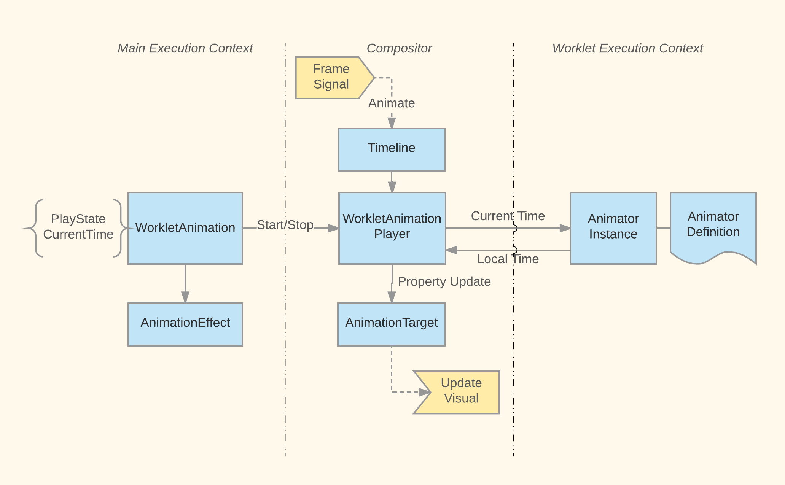

# Animation Worklet This directory contains source code that implements Animation Worklet API.

See [Animation Worklet Explainer](https://github.com/WICG/animation-worklet/blob/gh-pages/README.md)
for the set of web-exposed API that implements.

## Animations in Worklet Context

AnimationWorklet provides worklet context that hosts and runs animations in isolation from main
document execution context. It is however not responsible for scheduling animation frames or
directly updating the DOM element or their visuals but rather relies on other components for these.

A normal worklet's animation frame cycle involves the following:  1. Receive animation frame request
signal (a.k.a mutation) along with the animation input for this frame  2. Run all animations (in
future we may selectively run animations if their input changes)  3. Record animation output in form
of "time" values  4. Send animation output

A key function that encapsulate this cycle is [`AnimationWorkletGlobalScope::Mutate()`](./AnimationWorkletGlobalScope.cpp).

At the moment, animation worklet thread only interacts with compositor thread. This means in step 1
it receives input from compositor thread and in step 4 it sends output to compositor thread.

## Interaction With Compositor

For a logical concept of a worklet animation, there is an equivalent underlying object in both
compositor and worklet contexts. In compositor, there is a `WorkletAnimationPlayer` and in worklet
there is an `Animator` object.

The compositor player object controls the life time and play state of the worklet equivalent. In
particular the compositor player Id also identifies the corresponding animator in the worklet
context.

Compositor animation inputs depend on frame timestamp and layer scroll offsets. Whenever these
change, compositor initiates an animation frame request to the worklet thread and blocks on
receiving update from it. This is fairly simple but inefficient scheduling method. In particular we
may invalidate animation inputs multiple times in a single frame (i.e., impl frame begin, after
commit, and after scorlling) and blocking compositor is not necessary. A more efficient scheduling
algorithm is upcoming.

## Interaction with Main

Worklet and main document contexts do not interact directly to run animations but are mediated via
compositor.

As far as main is concerned worklet animations are simply composited animations that it hands over
to compositor. A key difference is that unlike typical composited animations, main does not run its
own version of the animation to update computed style. So it needs to receive property value
updates from compositor (this is not yet in place).

## Testing

Layout tests that cover web-exposed API for Animation Worklet are tested in [`LayoutTests/virtual/th
readed/fast/animationworklet/`](../../../LayoutTests/virtual/threaded/fast/animationworklet/).

There are unit tests covering animation worklet and global scope in [`modules/animationworklet`](.).
