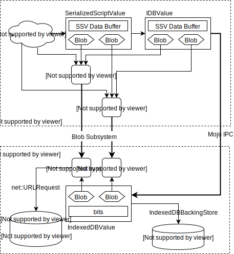
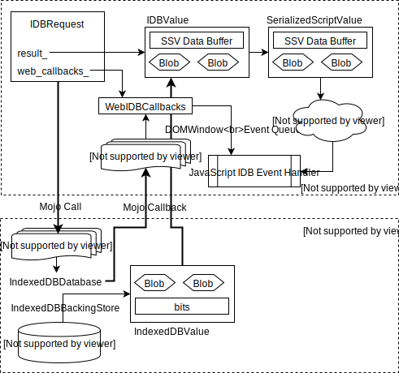
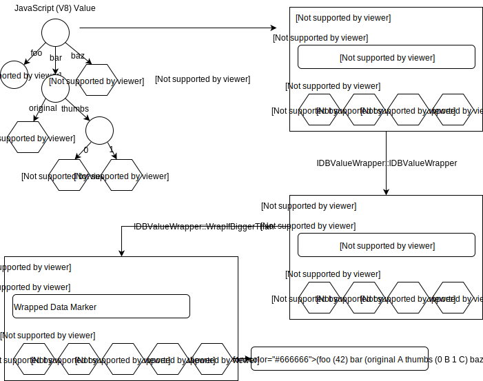
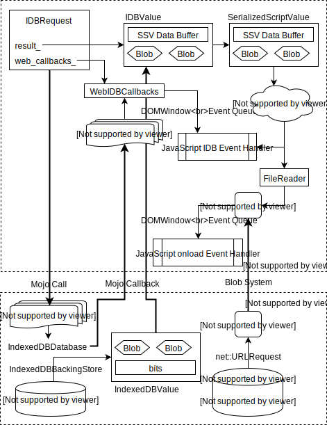

# IndexedDB Data follow-up

[TOC]

## Summary

Chrome's IndexedDB implementation uses two backing stores for user data:

* [The Blob system](https://chromium.googlesource.com/chromium/src/+/master/storage/browser/blob/README.md),
  stores [Blobs](https://developer.mozilla.org/en-US/docs/Web/API/Blob) as files
  in a per-origin directory. Blobs are specifically designed for storing large
  amounts of data.
* [LevelDB](https://github.com/google/leveldb) is a key-value store optimized
  for small keys (10s-100s of bytes) and fairly small values (10s-1000s of
  bytes). Chrome creates a per-origin LevelDB database that holds the data for
  all the origin's IndexedDB databases. The LevelDB database also holds
  references to the Blobs stored in the Blob system.

Blink wraps large IndexedDB values (whose serialized size is at or above 64KB)
in Blobs before being sent to the browser's LevelDB-based backing store.
Specifically, for each large value, Blink creates a Blob that holds the
serialized value, and stores a reference to that Blob in the IndexedDB backing
store.

## Value Serialization

The logic for converting between (JavaScript)
[V8](https://developers.google.com/v8/) values and the byte sequences in
IndexedDB's backing store is contained in `SerializedScriptValue` (SSV), which
delegates to V8's `v8::ValueSerializer`. The value format used with the backing
store is essentially a data buffer that stores a sequence of bytes, and a list
(technically, an ordered set) of Blobs.

Changes to the IndexedDB serialization format are delicate because our backing
store does not have any form of data migration. Once written to the backing
store, an IndexedDB value's format will never change. This means that
SerializedScriptValue must read serialized values written by all previous
versions of Chrome. To avoid data corruption, the SSV implementation should
also detect (and reject) serialized values written by future Chrome versions,
which can happen when a user downgrades the browser (e.g., by switching channels
from beta to stable) and [when serialization changes are
reverted](https://crbug.com/700603). For the reasons above, technical debt
introduced by unnecessary complexity in the serialization format is much more
difficult to pay than in most of the Chrome codebase.

IndexedDB serialization changes must take the following subtleties into account:

* The `SerializedScriptValue` code is tightly coupled with
  `v8::ValueSerializer`. For this reason, SSV should not host logic that might
  later be moved to the browser process. Such moves are bound to be difficult,
  because V8 is definitely staying in the renderer process.
* The SerializedScriptValue API, which is synchronous, is incompatible with
  reading Blobs (or any sort of files), which must be done asynchronously. All
  the information needed by SSV deserialization must be fetched before the
  deserialization is invoked.

## Data Flow for Small Values

### Write Path

All the IndexedDB write operations
([put](https://developer.mozilla.org/en-US/docs/Web/API/IDBObjectStore/put),
[add](https://developer.mozilla.org/en-US/docs/Web/API/IDBObjectStore/add), or
[update](https://developer.mozilla.org/en-US/docs/Web/API/IDBCursor/update)) are
currently routed through an `IDBObjectStore::put` overload.

All IndexedDB requests (reads and writes) are sent via
[Mojo](https://chromium.googlesource.com/chromium/src/+/master/mojo/README.md)
IPC from the renderer running the Web application to to the browser process,
where they are fulfilled. Most of the data associated with an IndexedDB write
operation is transferred from the renderer to the browser using one Mojo call,
and is therefore subject to the Mojo message limit. Blobs are an exception, as
they are transferred to the browser process using the [Blob
subsystem](https://chromium.googlesource.com/chromium/src/+/master/storage/browser/blob/README.md).

*** aside
Images in this document embed the data needed for editing using
[draw.io](https://github.com/jgraph/drawio).
***

### Read Path

The Web platform has a simple, [synchronous API for creating a
Blob](https://developer.mozilla.org/en-US/docs/Web/API/Blob/Blob), which can be
used in one line of code. Conversely, [reading a Blob's
content](https://developer.mozilla.org/en-US/docs/Web/API/FileReader) is an
asynchronous process that requires creating an intermediate FileReader instance,
and setting up a handler for its [loadend
event](https://developer.mozilla.org/en-US/docs/Web/Events/loadend). This is not
an accident. When a Blob is constructed, all the information needed to build its
content is available in the renderer calling the constructor. Once constructed,
a Blob instance only stores a handle to the content -- for example, most Blobs
in Chrome point to on-disk files. This is the core reason behind the significant
complexity gap between IndexedDB value wrapping (write-side changes)
and unwrapping (read-side changes).

An IndexedDB read operation, like
[IDBObjectStore.get()](https://developer.mozilla.org/en-US/docs/Web/API/IDBObjectStore/get),
creates an
[IDBRequest](https://developer.mozilla.org/en-US/docs/Web/API/IDBRequest) that
tracks the status of the operation. Blink's `IDBRequest` implementation creates
a `WebIDBCallbacks` instance, and passes the request and the callback to
[the browser-side IndexedDB
API](https://cs.chromium.org/chromium/src/content/browser/indexed_db/indexed_db_database.h).

The browser-side IndexedDB implementation processes requests from the renderer
in a single-threaded loop, and relies on Mojo to queue incoming requests. The
[IndexedDB backing
store](https://cs.chromium.org/chromium/src/content/browser/indexed_db/indexed_db_backing_store.h)
retrieves the desired value(s). Each
[IndexedDBValue](https://cs.chromium.org/chromium/src/content/browser/indexed_db/indexed_db_value.h)
contains the SSV data (treated as an opaque sequence of bits, on the
browser-side) and a vector of Blob handles.

The result of each read operation is sent from the browser process to the
renderer process via a callback (a Mojo call to an interface associated with the
database receiving the request). In the renderer process, the result is
converted to a `WebIDBValue` and passed to the `WebIDBCallbacks` instance, which
further passses it on to the corresponding IDBRequest. The IDBRequest updates
the Blink-side IndexedDB state, attaches the `IDBValue` result to the
IDBRequest, creates a DOM event representing the result and queues the event.

*** aside
This description glosses over a couple of layers that will hopefully be
eliminated or merged in the not-too-distant future.
***

The Blink-side result processing has a few subtleties that are relevant to this
design:

* [The IndexedDB specification](https://w3c.github.io/IndexedDB/) states that
  IDBRequests within the same transaction must be executed in the order in which
  they are created, and the events indicating their success / failure must be
  delivered according to the same order. Chrome's implementation relies on the
  following to meet the ordering demands:
    - IDBRequests are turned into Mojo calls to the browser process
      synchronously, when they are created. All the calls for a transaction are
      made to the same database interface, so Mojo guarantees that they're
      ordered.
    - On the browser side, all requests are processed on the same thread, and
      hop through threads in exactly the same way, so the requests ordering is
      preserved.
    - Results (IndexedDBValue -> Value -> WebIDBValue) are passed to the browser
      process via Callbacks interfaces associated with the database interface,
      so Mojo guarantees that the calls go over the same Mojo pipe, and
      therefore are ordered.
    - Each result is processed and turned into a DOM event synchronously, so DOM
      events for a transaction are queued up in the same order as the results
      received from the browser.
* The IDBValue attached to an IDBRequest is lazily de-serialized when the Web
  application reads the IDBRequest's [result
  property](https://developer.mozilla.org/en-US/docs/Web/API/IDBRequest/result)
  for the first time, which (for most applications) happens in the IDBRequest
  success event handler. The SSV deserialization logic is invoked at that point,
  so SSVs must be deserialized synchronously.
* The `ExecutionContext` used to dispatch DOM events may be suspended, which
  happens when the user creates a JavaScript breakpoint in
  [DevTools](https://developers.google.com/web/tools/chrome-devtools/), and the
  breakpoint is hit. At the time of this writing, each Blink feature deals with
  suspended execution contexts individually. In most cases (think input events),
  the simple strategy of dropping the events on the floor is acceptable.
  Unfortunately, this is not acceptable for IndexedDB, so IDBRequest events must
  be queued and dispatched in-order when the ExecutionContext is resumed.

## Data Flow for Large Values

Blink wraps large IndexedDB values (whose serialized size is at or above 64KB)
in Blobs before sending them to the browser's LevelDB-based backing store.
While IndexedDB value wrapping is currently done entirely inside Blink, the
system was designed to make it easy to push value-wrapping into the browser
process, if this becomes desirable in the future.

Blobs that contain SSV data use the MIME type
[application/vnd.blink-idb-value-wrapper](https://www.iana.org/assignments/media-types/application/vnd.blink-idb-value-wrapper).
In order to be as user-friendly as possible (for the unlikely event that a
developer is exposed to a Blob wrapping an SSV data buffer), the MIME type was
chosen to be easily searchable and fairly self-explanatory, and was registered
with IANA.

The wrapping threshold (currently 64KB) takes the following factors into
account:

* Storing large values in LevelDB would result in large internal data structures
  (SSTable blocks), which can impact the efficiency and memory consumption of
  database operations (especially of compaction). For example, large SSTable
  blocks led to browser OOMs in [this P0 issue](https://crbug.com/702787).
* The Mojo message limit is currently Web-exposed as an IndexedDB limit, because
  each write request is sent as a single Mojo call.

### Write Side

`IDBValueWrapper` contains all the logic for serializing an IndexedDB value via
`SerializedScriptValue`. `IDBObjectStore::put` passes the V8 value into
IDBValueWrapper, and gets back the SSV data that is passed to the browser-side
IndexedDB implementation. When given a large IndexedDB value, `IDBValueWrapper`
creates a Blob that holds the serialized value, and stores a reference to that
Blob in the IndexedDB backing store.

### Read Side

Large IndexedDB values are unwrapped in Blink using a fairly close emulation to
the process used by a Web application to read the contents of a Blob stored
inside an IndexedDB value, so it is instructive to understand what happens in
that case.

1. The Web application's JavaScript (most likely, the IDBRequest success event
   handler) extracts a
   [Blob](https://developer.mozilla.org/en-US/docs/Web/API/Blob) from the
   request's
   [result](https://developer.mozilla.org/en-US/docs/Web/API/IDBRequest/result).
   The Blob instance only stores metadata about the Blob's content, represented
   as a `blink::BlobDataHandle`.
2. The Web application creates a
   [FileReader](https://developer.mozilla.org/en-US/docs/Web/API/FileReader),
   and calls one of its read methods, most likely
   [readAsArrayBuffer](https://developer.mozilla.org/en-US/docs/Web/API/FileReader/readAsArrayBuffer).
   Blink's `FileReader` implementation uses a `FileReaderLoader` to retrieve the
   Blob's content from
   [the Blob system](https://chromium.googlesource.com/chromium/src/+/master/storage/browser/blob/README.md)
   in the browser process.
3. When the Blob's contents is completely transferred to the renderer process,
   FileReaderLoader's `DidFinishLoading` is called, which eventually causes the
   FileReader to queue an
   [onload event](https://developer.mozilla.org/en-US/docs/Web/API/FileReader/onload).
4. The Web application's onload event handler retrieves the Blob data from the
   FileReader's result property.

The IndexedDB read path uses classes below to detect and unwrap Blob-wrapped
IDBValues. Reading Blob contents must be asynchronous, because Blobs can be
disk-backed (in fact, all Blobs coming from IndexedDB are currently
disk-backed).

* `IDBValueUnwrapper` knows how to decode the serialization format used by
  wrapped data markers. It can tell whether an IDBValue contains a wrapped
  data marker and, if so, it can extract a BlobDataHandler pointing to the
  Blob that contains the wrapped SSV data.
* `IDBRequestLoader` coordinates a FileReaderLoader and an IDBValueUnwrapper to
  map an array of IDBValues that may contain wrapped SSV data into IDBValues
  that are guaranteed to be  unwrapped. IDBRequestLoader operates on an array of
  values because some requests, like
  [IDBObjectStore::getAll](https://developer.mozilla.org/en-US/docs/Web/API/IDBObjectStore/getAll)
  return an array of results. Single-result requests, like
  [IDBObjectStore::get](https://developer.mozilla.org/en-US/docs/Web/API/IDBObjectStore/get)
  are handled by wrapping the result in a one-element array.
* `IDBRequestQueueItem` holds on to an IDBRequest for which Blink has received
  an IDBValue from the browser process, but hasn't queued up a corresponding
  event in the DOMWindow event queue.

IDBValue unwrapping relies on the following data in existing IndexedDB objects.

* Each `IDBTransaction` owns a queue of IDBRequestQueueItems, where the queue
  ordering reflects the order in which the requests were issued by the Web
  application.
* `IDBRequest` exposes `HandleResponse` methods (overloaded to account for
  different response types), in addition to `EnqueueResponse` methods.
  WebIDBCallbacks calls into a HandleResponse method, which handles SSV
  unwrapping and queueing. EnqueueResponse is responsible for updating the
  IDBRequest's status (e.g., its result property) and enqueueing a DOM event in
  the appropriate queue.

Reading large values follows a slightly more complex process than reading small
values. For simplicity, we describe the single-IDBValue case. Extending the
logic to an IDBValue array is fairly straightforward.

1. When a WebIDBCallbacks instance receives the result of an IndexedDB
   operation from the browser-side implementation, it passes the result's
   IDBValue to a HandleResponse overload on its associated IDBRequest.
2. HandleResponse asks IDBValueUnwrapper if the IDBValue's SSV data is wrapped
   in a Blob.
    * Fast path: If the IDBValue's SSV data is not wrapped, and the
      IDBTransaction associated with the request doesn't have any queued result,
      an EnqueueResponse overload is called.
    * Slow path: An IDBRequestQueueItem is created for the IDBRequest and added
      to the IDBTransaction's result queue.
3. If the IDBValue's SSV data is wrapped in a Blob, an IDBRequestLoader instance
   is created and associated with the newly created IDBRequestQueueItem. The
   IDBRequestLoader is given the IDBValue that needs to be unwrapped.
4. If an IDBRequestLoader was created above, the loading process is started.
   The IDBRequestLoader uses IDBValueUnwrapper to obtain a reference to the Blob
   that contains the SSV data, and then uses an embedded FileReader instance to
   fetch the Blob's contents from the browser process.
5. When an IDBRequestLoader finishes retrieving the Blob's contents, it marks
   the IDBRequestQueueItem as ready, and notifies the IDBTransaction that an
   item in the result queue has become ready.
6. When the head item in an IDBTransaction's result queue is ready, it is
   removed from the queue, and an EnqueueResult overload is called on the
   IDBRequest associated with the IDBRequestQueueItem.

